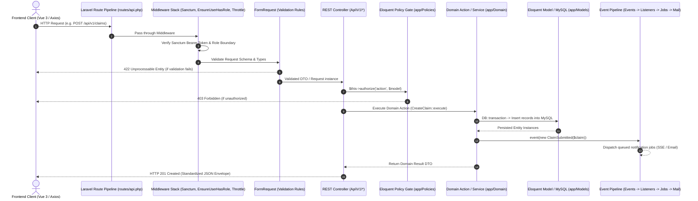

# System Architecture Reference
## Wollo University Lost & Found System

<!-- source: composer.json -->
<!-- source: client/package.json -->
<!-- source: app/Providers/ -->

---

### 1. Technology Stack

| Component | Technology | Version | Purpose / Role in System |
|-----------|------------|---------|---------------------------|
| **Backend Framework** | Laravel | `^13.17` (Laravel 13) | RESTful API backend, routing, Eloquent ORM, middleware, queued jobs. |
| **Runtime Engine** | PHP | `^8.3` | Modern strictly-typed PHP execution runtime. |
| **Authentication** | Laravel Sanctum | `^4.0` | SPA session cookies and Bearer token issuance. |
| **Database Engine** | MySQL | `8.0+` (InnoDB) | Relational persistence, foreign keys, row locks, composite & fulltext indexing. |
| **Frontend Framework** | Vue.js | `^3.5.40` (Vue 3) | Reactive Composition API frontend application. |
| **Language** | TypeScript | `~6.0.2` | Strictly-typed frontend codebase with full type contracts. |
| **State Management** | Pinia | `^4.0.3` | Modular client-side state stores. |
| **Client Routing** | Vue Router | `^5.2.0` | Client-side navigation, history mode, auth navigation guards. |
| **Styling & UI** | Tailwind CSS | `^4.3.3` | Utility-first CSS styling system. |
| **Build Tooling** | Vite | `^8.2.0` | Frontend module bundler and hot module replacement dev server. |
| **HTTP Client** | Axios | `^1.19.0` | Promise-based HTTP client with request/response interceptors. |
| **Iconography** | Lucide Vue Next | `^1.0.0` | Scalable SVG icon components. |

---

### 2. Annotated Directory Structure

```
wollo-lost-found/
├── client/                                    # Vue 3 + TypeScript Frontend Application
│   ├── src/
│   │   ├── app/                              # Root application configuration & providers
│   │   ├── assets/                           # Static assets, styling tokens, and images
│   │   ├── components/                       # Shared UI components (modals, tables, badges)
│   │   ├── composables/                      # Vue 3 composition functions (auth, modals)
│   │   ├── constants/                        # Global system constants and enumerations
│   │   ├── directives/                       # Custom Vue directives (e.g. v-can for RBAC)
│   │   ├── features/                         # Modular feature domains (API, stores, types)
│   │   │   ├── admin/                        # Administrative hubs, campuses, RBAC management
│   │   │   ├── auth/                         # Authentication, OTP verification, password reset
│   │   │   ├── claims/                       # Claims submission, proof upload, review gates
│   │   │   ├── custody/                      # Physical custody logs & storage bin allocation
│   │   │   ├── items/                        # Item reporting (lost/found), photo management
│   │   │   ├── lookups/                      # Taxonomy references (categories, locations)
│   │   │   ├── match-suggestions/            # Suggestion review & pairing confirmation
│   │   │   ├── notifications/                # Real-time SSE listener & inbox management
│   │   │   ├── profile/                      # User profile & avatar management
│   │   │   └── returns/                      # Return processing, digital signature verification
│   │   ├── layouts/                          # App shell layouts (DashboardLayout, AuthLayout)
│   │   ├── lib/                              # HTTP client, interceptors, error parsers
│   │   ├── permissions/                      # RBAC stores, capability checkers, v-can helpers
│   │   ├── router/                           # Vue Router route map, meta tags, auth guards
│   │   ├── stores/                           # Global UI and application context Pinia stores
│   │   ├── types/                            # Global TypeScript interfaces & DTOs
│   │   └── views/                            # Route view pages categorized by role/domain
└── server/                                    # Laravel 13 REST API Backend
    ├── app/
    │   ├── Console/                          # Artisan commands & scheduled tasks
    │   ├── Domain/                           # DDD feature modules (Actions, DTOs, Services)
    │   │   ├── Administration/               # Dashboard analytics & report generators
    │   │   ├── Auth/                         # Authentication actions, OTP services
    │   │   ├── Claims/                       # Claim workflows, approvals, reversals
    │   │   ├── Custody/                      # Physical vault movements & transfers
    │   │   ├── Items/                        # Item lifecycle, search, duplicate detection
    │   │   ├── Matching/                     # NLP tokenization & Jaccard similarity engine
    │   │   ├── Notifications/                # Notification preferences & delivery
    │   │   └── Returns/                      # Handover verification, PDF receipt generator
    │   ├── Events/                           # System domain events (ItemReported, ClaimApproved)
    │   ├── Exceptions/                       # Custom domain business exceptions
    │   ├── Http/
    │   │   ├── Controllers/Api/V1/           # API v1 REST Controllers grouped by domain
    │   │   ├── Middleware/                   # Custom middleware (EnsureUserHasRole, Throttle)
    │   │   └── Requests/Api/V1/              # FormRequest validation rules
    │   ├── Jobs/                             # Asynchronous queued jobs (matching, emails, PDFs)
    │   ├── Listeners/                        # Event listeners responding to domain events
    │   ├── Mail/                             # Mailable classes for email notifications
    │   ├── Models/                           # Eloquent ORM active record models
    │   ├── Policies/                         # Authorization Gate & Policy classes
    │   ├── Providers/                        # Application service providers
    │   └── Support/Services/                 # Cross-cutting support services (Audit, Storage, RBAC)
    ├── database/
    │   ├── factories/                        # Model test factories
    │   ├── migrations/                       # 43 database schema migrations
    │   └── seeders/                          # Database seeders (roles, locations, taxonomies)
    └── routes/
        ├── api.php                           # API v1 routing table with prefix & middleware groups
        └── console.php                       # Artisan console route bindings
```

---

### 3. Request Lifecycle
<!-- source: app/Http/Controllers/ -->
<!-- source: app/Http/Middleware/ -->



---

### 4. Domain Service Layer
<!-- source: app/Support/Services/ -->
<!-- source: app/Domain/ -->

#### `\App\C:\Users\W\Desktop\wollo-lost-found\server\app\Domain\Administration\Services\DashboardStatisticsService`
<!-- source: C:/Users/W/Desktop/wollo-lost-found/server/app/Domain/Administration/Services/DashboardStatisticsService.php -->
**File:** `C:/Users/W/Desktop/wollo-lost-found/server/app/Domain/Administration/Services/DashboardStatisticsService.php`  
**Responsibility:** Encapsulates domain logic and transaction boundaries for its respective subsystem.
**Public Methods:**
- *Invokable action or internal service helper.*

#### `\App\C:\Users\W\Desktop\wollo-lost-found\server\app\Domain\Administration\Services\ReportExportService`
<!-- source: C:/Users/W/Desktop/wollo-lost-found/server/app/Domain/Administration/Services/ReportExportService.php -->
**File:** `C:/Users/W/Desktop/wollo-lost-found/server/app/Domain/Administration/Services/ReportExportService.php`  
**Responsibility:** Encapsulates domain logic and transaction boundaries for its respective subsystem.
**Public Methods:**
- *Invokable action or internal service helper.*

#### `\App\C:\Users\W\Desktop\wollo-lost-found\server\app\Domain\Administration\Services\UserAdministrationService`
<!-- source: C:/Users/W/Desktop/wollo-lost-found/server/app/Domain/Administration/Services/UserAdministrationService.php -->
**File:** `C:/Users/W/Desktop/wollo-lost-found/server/app/Domain/Administration/Services/UserAdministrationService.php`  
**Responsibility:** Encapsulates domain logic and transaction boundaries for its respective subsystem.
**Public Methods:**
- *Invokable action or internal service helper.*

#### `\App\C:\Users\W\Desktop\wollo-lost-found\server\app\Domain\Auth\Services\AuthenticationService`
<!-- source: C:/Users/W/Desktop/wollo-lost-found/server/app/Domain/Auth/Services/AuthenticationService.php -->
**File:** `C:/Users/W/Desktop/wollo-lost-found/server/app/Domain/Auth/Services/AuthenticationService.php`  
**Responsibility:** Encapsulates domain logic and transaction boundaries for its respective subsystem.
**Public Methods:**
- *Invokable action or internal service helper.*

#### `\App\C:\Users\W\Desktop\wollo-lost-found\server\app\Domain\Auth\Services\OtpService`
<!-- source: C:/Users/W/Desktop/wollo-lost-found/server/app/Domain/Auth/Services/OtpService.php -->
**File:** `C:/Users/W/Desktop/wollo-lost-found/server/app/Domain/Auth/Services/OtpService.php`  
**Responsibility:** Encapsulates domain logic and transaction boundaries for its respective subsystem.
**Public Methods:**
- *Invokable action or internal service helper.*

#### `\App\C:\Users\W\Desktop\wollo-lost-found\server\app\Domain\Auth\Services\PasswordService`
<!-- source: C:/Users/W/Desktop/wollo-lost-found/server/app/Domain/Auth/Services/PasswordService.php -->
**File:** `C:/Users/W/Desktop/wollo-lost-found/server/app/Domain/Auth/Services/PasswordService.php`  
**Responsibility:** Encapsulates domain logic and transaction boundaries for its respective subsystem.
**Public Methods:**
- *Invokable action or internal service helper.*

#### `\App\C:\Users\W\Desktop\wollo-lost-found\server\app\Domain\Claims\Services\ClaimService`
<!-- source: C:/Users/W/Desktop/wollo-lost-found/server/app/Domain/Claims/Services/ClaimService.php -->
**File:** `C:/Users/W/Desktop/wollo-lost-found/server/app/Domain/Claims/Services/ClaimService.php`  
**Responsibility:** Encapsulates domain logic and transaction boundaries for its respective subsystem.
**Public Methods:**
- *Invokable action or internal service helper.*

#### `\App\C:\Users\W\Desktop\wollo-lost-found\server\app\Domain\Custody\Services\CustodyService`
<!-- source: C:/Users/W/Desktop/wollo-lost-found/server/app/Domain/Custody/Services/CustodyService.php -->
**File:** `C:/Users/W/Desktop/wollo-lost-found/server/app/Domain/Custody/Services/CustodyService.php`  
**Responsibility:** Encapsulates domain logic and transaction boundaries for its respective subsystem.
**Public Methods:**
- *Invokable action or internal service helper.*

#### `\App\C:\Users\W\Desktop\wollo-lost-found\server\app\Domain\Items\Services\DuplicateDetectionService`
<!-- source: C:/Users/W/Desktop/wollo-lost-found/server/app/Domain/Items/Services/DuplicateDetectionService.php -->
**File:** `C:/Users/W/Desktop/wollo-lost-found/server/app/Domain/Items/Services/DuplicateDetectionService.php`  
**Responsibility:** Encapsulates domain logic and transaction boundaries for its respective subsystem.
**Public Methods:**
- *Invokable action or internal service helper.*

#### `\App\C:\Users\W\Desktop\wollo-lost-found\server\app\Domain\Items\Services\ItemReferenceCodeService`
<!-- source: C:/Users/W/Desktop/wollo-lost-found/server/app/Domain/Items/Services/ItemReferenceCodeService.php -->
**File:** `C:/Users/W/Desktop/wollo-lost-found/server/app/Domain/Items/Services/ItemReferenceCodeService.php`  
**Responsibility:** Encapsulates domain logic and transaction boundaries for its respective subsystem.
**Public Methods:**
- *Invokable action or internal service helper.*

#### `\App\C:\Users\W\Desktop\wollo-lost-found\server\app\Domain\Items\Services\ItemSearchService`
<!-- source: C:/Users/W/Desktop/wollo-lost-found/server/app/Domain/Items/Services/ItemSearchService.php -->
**File:** `C:/Users/W/Desktop/wollo-lost-found/server/app/Domain/Items/Services/ItemSearchService.php`  
**Responsibility:** Encapsulates domain logic and transaction boundaries for its respective subsystem.
**Public Methods:**
- *Invokable action or internal service helper.*

#### `\App\C:\Users\W\Desktop\wollo-lost-found\server\app\Domain\Matching\Services\ItemMatchingService`
<!-- source: C:/Users/W/Desktop/wollo-lost-found/server/app/Domain/Matching/Services/ItemMatchingService.php -->
**File:** `C:/Users/W/Desktop/wollo-lost-found/server/app/Domain/Matching/Services/ItemMatchingService.php`  
**Responsibility:** Encapsulates domain logic and transaction boundaries for its respective subsystem.
**Public Methods:**
- *Invokable action or internal service helper.*

#### `\App\C:\Users\W\Desktop\wollo-lost-found\server\app\Domain\Matching\Services\JaccardSimilarityService`
<!-- source: C:/Users/W/Desktop/wollo-lost-found/server/app/Domain/Matching/Services/JaccardSimilarityService.php -->
**File:** `C:/Users/W/Desktop/wollo-lost-found/server/app/Domain/Matching/Services/JaccardSimilarityService.php`  
**Responsibility:** Encapsulates domain logic and transaction boundaries for its respective subsystem.
**Public Methods:**
- *Invokable action or internal service helper.*

#### `\App\C:\Users\W\Desktop\wollo-lost-found\server\app\Domain\Matching\Services\TokenizerService`
<!-- source: C:/Users/W/Desktop/wollo-lost-found/server/app/Domain/Matching/Services/TokenizerService.php -->
**File:** `C:/Users/W/Desktop/wollo-lost-found/server/app/Domain/Matching/Services/TokenizerService.php`  
**Responsibility:** Encapsulates domain logic and transaction boundaries for its respective subsystem.
**Public Methods:**
- *Invokable action or internal service helper.*

#### `\App\C:\Users\W\Desktop\wollo-lost-found\server\app\Domain\Notifications\Services\NotificationPreferenceService`
<!-- source: C:/Users/W/Desktop/wollo-lost-found/server/app/Domain/Notifications/Services/NotificationPreferenceService.php -->
**File:** `C:/Users/W/Desktop/wollo-lost-found/server/app/Domain/Notifications/Services/NotificationPreferenceService.php`  
**Responsibility:** Encapsulates domain logic and transaction boundaries for its respective subsystem.
**Public Methods:**
- *Invokable action or internal service helper.*

#### `\App\C:\Users\W\Desktop\wollo-lost-found\server\app\Domain\Notifications\Services\NotificationService`
<!-- source: C:/Users/W/Desktop/wollo-lost-found/server/app/Domain/Notifications/Services/NotificationService.php -->
**File:** `C:/Users/W/Desktop/wollo-lost-found/server/app/Domain/Notifications/Services/NotificationService.php`  
**Responsibility:** Encapsulates domain logic and transaction boundaries for its respective subsystem.
**Public Methods:**
- *Invokable action or internal service helper.*

#### `\App\C:\Users\W\Desktop\wollo-lost-found\server\app\Domain\Returns\Services\ReturnPdfService`
<!-- source: C:/Users/W/Desktop/wollo-lost-found/server/app/Domain/Returns/Services/ReturnPdfService.php -->
**File:** `C:/Users/W/Desktop/wollo-lost-found/server/app/Domain/Returns/Services/ReturnPdfService.php`  
**Responsibility:** Encapsulates domain logic and transaction boundaries for its respective subsystem.
**Public Methods:**
- *Invokable action or internal service helper.*

#### `\App\C:\Users\W\Desktop\wollo-lost-found\server\app\Domain\Returns\Services\ReturnService`
<!-- source: C:/Users/W/Desktop/wollo-lost-found/server/app/Domain/Returns/Services/ReturnService.php -->
**File:** `C:/Users/W/Desktop/wollo-lost-found/server/app/Domain/Returns/Services/ReturnService.php`  
**Responsibility:** Encapsulates domain logic and transaction boundaries for its respective subsystem.
**Public Methods:**
- *Invokable action or internal service helper.*

#### `\App\C:\Users\W\Desktop\wollo-lost-found\server\app\Support\Services\AuditLogger`
<!-- source: C:/Users/W/Desktop/wollo-lost-found/server/app/Support/Services/AuditLogger.php -->
**File:** `C:/Users/W/Desktop/wollo-lost-found/server/app/Support/Services/AuditLogger.php`  
**Responsibility:** Encapsulates domain logic and transaction boundaries for its respective subsystem.
**Public Methods:**
- *Invokable action or internal service helper.*

#### `\App\C:\Users\W\Desktop\wollo-lost-found\server\app\Support\Services\FileStorageService`
<!-- source: C:/Users/W/Desktop/wollo-lost-found/server/app/Support/Services/FileStorageService.php -->
**File:** `C:/Users/W/Desktop/wollo-lost-found/server/app/Support/Services/FileStorageService.php`  
**Responsibility:** Encapsulates domain logic and transaction boundaries for its respective subsystem.
**Public Methods:**
- *Invokable action or internal service helper.*

#### `\App\C:\Users\W\Desktop\wollo-lost-found\server\app\Support\Services\PermissionGroupService`
<!-- source: C:/Users/W/Desktop/wollo-lost-found/server/app/Support/Services/PermissionGroupService.php -->
**File:** `C:/Users/W/Desktop/wollo-lost-found/server/app/Support/Services/PermissionGroupService.php`  
**Responsibility:** Encapsulates domain logic and transaction boundaries for its respective subsystem.
**Public Methods:**
- *Invokable action or internal service helper.*

#### `\App\C:\Users\W\Desktop\wollo-lost-found\server\app\Support\Services\PermissionService`
<!-- source: C:/Users/W/Desktop/wollo-lost-found/server/app/Support/Services/PermissionService.php -->
**File:** `C:/Users/W/Desktop/wollo-lost-found/server/app/Support/Services/PermissionService.php`  
**Responsibility:** Encapsulates domain logic and transaction boundaries for its respective subsystem.
**Public Methods:**
- *Invokable action or internal service helper.*

#### `\App\C:\Users\W\Desktop\wollo-lost-found\server\app\Support\Services\RequestContext`
<!-- source: C:/Users/W/Desktop/wollo-lost-found/server/app/Support/Services/RequestContext.php -->
**File:** `C:/Users/W/Desktop/wollo-lost-found/server/app/Support/Services/RequestContext.php`  
**Responsibility:** Encapsulates domain logic and transaction boundaries for its respective subsystem.
**Public Methods:**
- *Invokable action or internal service helper.*

#### `\App\C:\Users\W\Desktop\wollo-lost-found\server\app\Support\Services\RoleService`
<!-- source: C:/Users/W/Desktop/wollo-lost-found/server/app/Support/Services/RoleService.php -->
**File:** `C:/Users/W/Desktop/wollo-lost-found/server/app/Support/Services/RoleService.php`  
**Responsibility:** Encapsulates domain logic and transaction boundaries for its respective subsystem.
**Public Methods:**
- *Invokable action or internal service helper.*

---

### 5. Frontend Architecture & Pinia State Stores
<!-- source: client/src/features/ -->
<!-- source: client/src/stores/ -->

| Store Name | File Path | Primary State Shape | Key Actions | Consumed API Endpoints |
|------------|-----------|---------------------|-------------|-------------------------|
| `useAuthStore` | `client/src/features/auth/stores/auth.store.ts` | `user`, `token`, `isAuthenticated`, `roles`, `permissions` | `login()`, `logout()`, `verifyEmail()`, `resetPassword()`, `fetchMe()` | `/api/v1/auth/*` |
| `useItemsStore` | `client/src/features/items/stores/items.store.ts` | `items`, `selectedItem`, `loading`, `pagination`, `filters` | `fetchItems()`, `reportLost()`, `reportFound()`, `uploadPhoto()`, `deletePhoto()` | `/api/v1/items/*` |
| `usePublicItemsStore` | `client/src/features/lookups/stores/public-items.store.ts` | `publicItems`, `currentItem`, `filters`, `loading` | `fetchPublicItems()`, `fetchItemDetails()`, `trackItem()` | `/api/v1/public/*` |
| `useClaimsStore` | `client/src/features/claims/stores/claims.store.ts` | `claims`, `currentClaim`, `reviewStatus`, `loading` | `submitClaim()`, `reviewClaim()`, `reverseClaim()` | `/api/v1/claims/*` |
| `useCustodyStore` | `client/src/features/custody/stores/custody.store.ts` | `custodyEvents`, `storageLocations`, `loading` | `recordCustodyEvent()`, `moveStorage()`, `fetchLocations()` | `/api/v1/custody/*` |
| `useReturnsStore` | `client/src/features/returns/stores/returns.store.ts` | `returns`, `activeReturn`, `verificationCode`, `signature` | `initiateReturn()`, `confirmReturn()`, `confirmByToken()`, `exportCsv()` | `/api/v1/returns/*` |
| `useMatchSuggestionsStore` | `client/src/features/match-suggestions/stores/match-suggestions.store.ts` | `suggestions`, `selectedPairing`, `loading` | `fetchSuggestions()`, `updateStatus()` | `/api/v1/match-suggestions/*` |
| `useNotificationsStore` | `client/src/features/notifications/stores/notifications.store.ts` | `notifications`, `unreadCount`, `preferences`, `sseConnected` | `initSseStream()`, `markAsRead()`, `markAllAsRead()`, `updatePreferences()` | `/api/v1/notifications/*` |
| `useAdminUsersStore` | `client/src/features/admin/stores/admin-users.store.ts` | `users`, `currentUser`, `rolesList`, `permissionsList` | `fetchUsers()`, `updateUserRole()`, `toggleActive()`, `syncPermissions()` | `/api/v1/admin/users/*` |
| `useAdminStore` | `client/src/features/admin/stores/admin.store.ts` | `statistics`, `campuses`, `categories`, `auditLogs`, `settings` | `fetchStatistics()`, `saveSettings()`, `generateReport()` | `/api/v1/admin/*` |
| `usePermissionsStore` | `client/src/permissions/stores/permissions.store.ts` | `userPermissions`, `userRoles` | `hasPermission()`, `hasRole()`, `can()` | Evaluates cached permission matrix |
| `useUiStore` | `client/src/stores/ui.store.ts` | `sidebarOpen`, `toastMessages`, `activeModal`, `theme` | `showToast()`, `toggleSidebar()`, `openModal()`, `closeModal()` | Client-only UI state |

---

### 6. Event & Notification Pipeline
<!-- source: app/Events/ -->
<!-- source: app/Listeners/ -->
<!-- source: app/Jobs/ -->
<!-- source: app/Mail/ -->

| Event Class | Triggering Operation | Associated Listener | Asynchronous Job Dispatched | Notification Delivery Channel |
|-------------|----------------------|---------------------|-----------------------------|-------------------------------|
| `ItemReported` | User reports lost or found item (`CreateLostItem`, `CreateFoundItem`). | `DispatchMatchSuggestion` | `GenerateMatchSuggestions`, `SendItemConfirmationEmail` | Database Notification, Email (`ItemSubmittedMail`), SSE Stream |
| `ClaimSubmitted` | Claimant asserts ownership (`CreateClaim`). | `NotifyClaimSubmitted` | `SendClaimSubmittedNotification` | Database Notification, Email (`ClaimSubmittedMail`), SSE Stream to Staff |
| `ClaimApproved` | Staff approves claim (`ApproveClaim`). | `NotifyClaimApproved` | `SendClaimDecisionNotification` | Database Notification, Email (`ClaimApprovedMail`), Real-time SSE |
| `ClaimRejected` | Staff rejects claim (`RejectClaim`). | `NotifyClaimRejected` | `SendClaimDecisionNotification` | Database Notification, Email (`ClaimRejectedMail`), Real-time SSE |
| `ItemReturned` | Physical handover completed (`GenerateReturnAcknowledgement`). | `NotifyItemReturned` | `SendReturnNotification`, `GenerateReturnConfirmationPdf` | Database Notification, Email (`ItemReturnedMail`), Signed PDF attachment |
| `CustodyTransferred` | Item moved to new storage bin (`MoveItemToStorage`). | `HandleCustodyTransferred` | `ProcessCustodyTransfer` | Internal audit log & staff notification |
| `NotificationCreated` | New notification record created in DB. | Broadcasts to SSE client | Directly streamed | `GET /api/v1/notifications/stream` |

---

### 7. File Storage Subsystem
<!-- source: app/Support/Services/FileStorageService.php:1-40 -->
<!-- source: config/filesystems.php -->

- **Storage Disks:**
  - `public` disk (`storage/app/public/`): Stores public-facing media such as item photographs (`items/`) and user avatars (`avatars/`). Accessible via `/storage/*` symlink.
  - `local` / private disk (`storage/app/private/`): Stores sensitive proof documents (`claims/evidence/`), recipient digital signatures (`returns/signatures/`), and generated PDF receipts (`reports/`, `returns/documents/`). Protected by controller authorization gates.
- **File Naming Convention:** Cryptographically generated UUID v4 filenames (e.g. `storage/app/public/items/8f9b2d3e-4a5c-6b7d-8e9f-0a1b2c3d4e5f.webp`) to prevent file enumeration attacks.
- **Security Controls:** Strict MIME type validation (JPEG, PNG, WEBP, PDF) and max file size limits enforced via FormRequest validation rules.