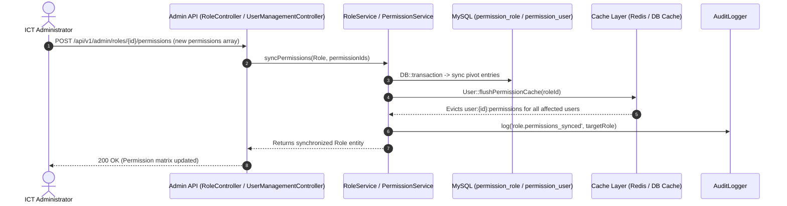

# Role-Based Access Control (RBAC) Architecture
## Wollo University Lost & Found System

<!-- source: database/seeders/RoleAndPermissionSeeder.php -->
<!-- source: app/Support/Services/RoleService.php -->
<!-- source: app/Support/Services/PermissionService.php -->
<!-- source: app/Models/User.php -->

---

### 1. Permission Model

#### 1.1 Relational Architecture
The RBAC architecture in the Wollo University Lost & Found System decouples authorization into modular, granular permission nodes grouped by domain functions. Five relational tables govern access evaluation:

| Table Name | Description | Key Foreign Relations |
|------------|-------------|-----------------------|
| `roles` | Defines standard and custom user roles (e.g. `admin`, `staff`, `student`, `guest`). | N/A (Root entity) |
| `permission_groups` | Categorizes permissions into domain modules (e.g. `items`, `claims`, `custody`, `admin`). | N/A (Root entity) |
| `permissions` | Granular permission nodes (e.g. `items.create`, `claims.review`, `users.manage`). | `group_id` → `permission_groups.id` |
| `permission_role` | Many-to-many junction attaching permissions to roles. | `role_id` → `roles.id`, `permission_id` → `permissions.id` |
| `permission_user` | Many-to-many junction granting or revoking direct permission overrides to specific users. | `user_id` → `users.id`, `permission_id` → `permissions.id` |

#### 1.2 Authorization Resolution Order
When checking whether an authenticated user is authorized for a specific permission string (via `$user->hasPermission('claims.review')` or `@can('claims.review')`), the authorization engine applies a 3-tier precedence evaluation:

```mermaid
flowchart TD
    A[Incoming Request / Gate Check] --> B{Account Active?}
    B -- No (is_active = false) --> C[Deny (403 Forbidden)]
    B -- Yes --> D{Is User Direct Grant in permission_user?}
    D -- Yes (Direct Grant) --> E[ALLOW Access]
    D -- No --> F{Is Permission in User's Assigned Role via permission_role?}
    F -- Yes (Role Match) --> G{Is Role Active?}
    G -- Yes --> E
    G -- No --> H[Deny Access]
    F -- No --> H[Deny Access (Default Deny)]
```

1. **Direct User Override (`permission_user`):** If the specific permission is assigned directly to the user record, access is immediately granted.
2. **Role Permission Mapping (`permission_role`):** If no direct user grant exists, the system resolves permissions inherited through the user's active role.
3. **Default Deny:** If the permission is not present in direct grants or active role assignments, the operation is denied with HTTP 403 Forbidden.

---

### 2. Role Catalogue
<!-- source: database/seeders/RoleAndPermissionSeeder.php:25-180 -->

#### Role: `admin` (System Administrator)
- **Role Name / Key:** `admin`
- **Amharic Display Name:** `የሲስተም አስተዳዳሪ`
- **Description:** Full administrative access to governance, settings, RBAC, users, and audit records.
- **System Role (Protected):** `Yes`
- **Active Status:** `Yes`
- **Assigned Permission Count:** 22 permissions

**Assigned Permissions List:**
- `ACCESS_ADMIN_DASHBOARD`
- `CHANGE_ITEM_STATUS`
- `DELETE_OWN_ITEM`
- `EDIT_OWN_ITEM`
- `GENERATE_REPORTS`
- `MANAGE_ALL_ITEMS`
- `MANAGE_CAMPUSES`
- `MANAGE_CATEGORIES`
- `MANAGE_CUSTODY`
- `MANAGE_LOCATIONS`
- `MANAGE_PERMISSIONS`
- `MANAGE_SETTINGS`
- `MANAGE_USERS`
- `MOVE_ITEM_CUSTODY`
- `PROCESS_RETURNS`
- `REPORT_FOUND`
- `REPORT_LOST`
- `REVERSE_CLAIMS`
- `REVIEW_CLAIMS`
- `SUBMIT_CLAIM`
- `SUSPEND_USERS`
- `VIEW_AUDIT_LOGS`

#### Role: `staff` (Security & Property Staff)
- **Role Name / Key:** `staff`
- **Amharic Display Name:** `የደህንነት እና ንብረት ሰራተኛ`
- **Description:** Operational custody, claim verification, physical returns, and item cataloging.
- **System Role (Protected):** `Yes`
- **Active Status:** `Yes`
- **Assigned Permission Count:** 12 permissions

**Assigned Permissions List:**
- `CHANGE_ITEM_STATUS`
- `DELETE_OWN_ITEM`
- `EDIT_OWN_ITEM`
- `MANAGE_ALL_ITEMS`
- `MANAGE_CUSTODY`
- `MOVE_ITEM_CUSTODY`
- `PROCESS_RETURNS`
- `REPORT_FOUND`
- `REPORT_LOST`
- `REVERSE_CLAIMS`
- `REVIEW_CLAIMS`
- `SUBMIT_CLAIM`

#### Role: `student` (Student & General User)
- **Role Name / Key:** `student`
- **Amharic Display Name:** `ተማሪ እና አጠቃላይ ተጠቃሚ`
- **Description:** Standard campus citizen account capable of reporting lost/found items and filing claims.
- **System Role (Protected):** `Yes`
- **Active Status:** `Yes`
- **Assigned Permission Count:** 5 permissions

**Assigned Permissions List:**
- `DELETE_OWN_ITEM`
- `EDIT_OWN_ITEM`
- `REPORT_FOUND`
- `REPORT_LOST`
- `SUBMIT_CLAIM`

---

### 3. Permission Catalogue
<!-- source: database/seeders/RoleAndPermissionSeeder.php:80-350 -->

| Permission Key | Display Name | Module Group | Enforcing Policy / Gate | Guarded Action |
|----------------|--------------|--------------|-------------------------|----------------|
| `REPORT_LOST` | Report Lost Property | Item Management | Middleware / Gate | Domain Action |
| `REPORT_FOUND` | Report Found Property | Item Management | Middleware / Gate | Domain Action |
| `EDIT_OWN_ITEM` | Edit Own Item Reports | Item Management | Middleware / Gate | Domain Action |
| `DELETE_OWN_ITEM` | Delete Own Item Reports | Item Management | Middleware / Gate | Domain Action |
| `MANAGE_ALL_ITEMS` | Manage All Campus Items | Item Management | Middleware / Gate | Domain Action |
| `CHANGE_ITEM_STATUS` | Change Item Lifecycle Status | Item Management | Middleware / Gate | Domain Action |
| `SUBMIT_CLAIM` | Submit Ownership Claims | Claims & Ownership Verification | Middleware / Gate | Domain Action |
| `REVIEW_CLAIMS` | Review & Verify Claims | Claims & Ownership Verification | Middleware / Gate | Domain Action |
| `REVERSE_CLAIMS` | Reverse Claim Decisions | Claims & Ownership Verification | Middleware / Gate | Domain Action |
| `MANAGE_CUSTODY` | Manage Physical Custody | Custody & Physical Returns | Middleware / Gate | Domain Action |
| `MOVE_ITEM_CUSTODY` | Transfer Storage Location | Custody & Physical Returns | Middleware / Gate | Domain Action |
| `PROCESS_RETURNS` | Process Property Handover | Custody & Physical Returns | Middleware / Gate | Domain Action |
| `MANAGE_USERS` | User Directory & Roles | User Accounts & Governance | Middleware / Gate | Domain Action |
| `SUSPEND_USERS` | Suspend User Accounts | User Accounts & Governance | Middleware / Gate | Domain Action |
| `ACCESS_ADMIN_DASHBOARD` | Access Admin Portal | System Infrastructure & RBAC | Middleware / Gate | Domain Action |
| `MANAGE_CAMPUSES` | Campus Management | System Infrastructure & RBAC | Middleware / Gate | Domain Action |
| `MANAGE_CATEGORIES` | Category Taxonomy | System Infrastructure & RBAC | Middleware / Gate | Domain Action |
| `MANAGE_LOCATIONS` | Building & Drop Points | System Infrastructure & RBAC | Middleware / Gate | Domain Action |
| `MANAGE_SETTINGS` | System Settings | System Infrastructure & RBAC | Middleware / Gate | Domain Action |
| `MANAGE_PERMISSIONS` | Manage Dynamic RBAC | System Infrastructure & RBAC | Middleware / Gate | Domain Action |
| `VIEW_AUDIT_LOGS` | View Security Audit Logs | Audit Logs & Reporting | Middleware / Gate | Domain Action |
| `GENERATE_REPORTS` | Generate Reports & Analytics | Audit Logs & Reporting | Middleware / Gate | Domain Action |

---

### 4. Cache Invalidation Architecture
<!-- source: app/Models/User.php:200-240 -->
<!-- source: app/Support/Services/RoleService.php:50-80 -->
<!-- source: app/Support/Services/PermissionService.php:40-75 -->

#### 4.1 Permission Caching Mechanism
To eliminate expensive recursive database joins during request handling, user permission sets are cached in Redis / MySQL Cache using the key convention `user:{id}:permissions` with a 24-hour TTL.

#### 4.2 Invalidation Trigger Points
`User::flushPermissionCache()` is deterministically invoked upon:
1. Administrative role reassignment (`PATCH /api/v1/admin/users/{id}/role`).
2. Direct user permission synchronization (`POST /api/v1/admin/users/{id}/permissions`).
3. Role-permission matrix modifications (`POST /api/v1/admin/roles/{id}/permissions`).
4. Role active status toggle or deletion.
5. Permission active status toggle.



---

### 5. Privilege Escalation Prevention
<!-- source: app/Policies/UserPolicy.php:25-60 -->
<!-- source: app/Http/Requests/Api/V1/Admin/UpdateUserRoleRequest.php:15-35 -->
<!-- source: app/Domain/Administration/Services/UserAdministrationService.php:40-80 -->

The system enforces multi-layered defenses to prevent horizontal and vertical privilege escalation:

1. **Strict Role Hierarchy Enforcement:** A user cannot assign a role with equal or higher privilege ranking than their own.
2. **Self-Demotion & Self-Deactivation Prevention:** An administrator cannot revoke their own `admin` role or deactivate their own account, preventing orphaned system access.
3. **Protected System Roles:** Roles with `is_system = true` (`admin`, `staff`, `student`) are protected against renaming, deletion, or slug modification.
4. **Direct Route Middleware Boundary:** Sensitive administrative routes are shielded by both Sanctum session token verification and `EnsureUserHasRole:admin` middleware before Eloquent policy evaluation.
5. **Immutable Audit Trail:** Every attempt to update roles, sync permissions, or toggle account status is captured in `audit_logs` with the actor's IP address and original/new state snapshots.